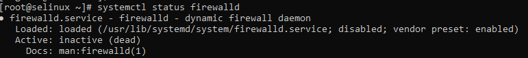
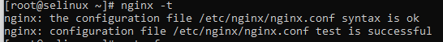
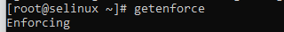
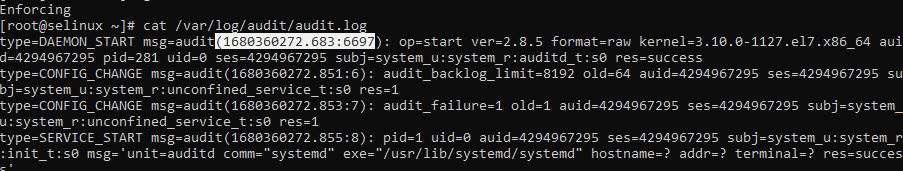
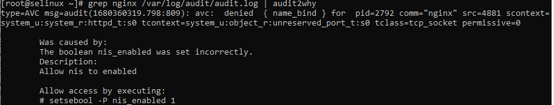
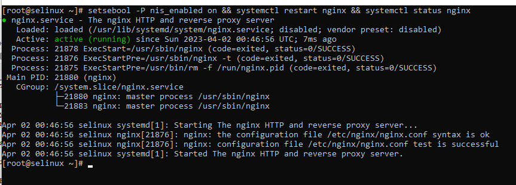

#**Задание 1:**
## **Запустить nginx на нестандартном порту 3-мя разными способами:**
- переключатели setsebool;
- добавление нестандартного порта в имеющийся тип;
- формирование и установка модуля SELinux.
____________________________________________________________-
## **Выполнение Задания 1**
1. Проверим, что в ОС отключен файервол:  
**systemctl status firewalld**

2. Проверим, что конфигурация nginx настроена без ошибок:  
**nginx -t**

3. Проверим режим работы SELinux:  
 **getenforce**
 
SELinux будет блокировать запрещенную активность
### **1 способ**
##### *Разрешим в SELinux работу nginx на порту TCP 4881 c помощью переключателей setsebool* 
1. Установим утилиту audit2why для просмотра логов
**yum install policycoreutils-python**
2. Определяем время создания лога /var/log/audit/audit.log
**cat /var/log/audit/audit.log**

4. Смотрим информацию о блокировании порта  
**grep nginx /var/log/audit/audit.log | audit2why**

Система сообщает, что параметр nis_enabled не корректен. 
5. Включим параметр nis_enabled и перезапустим nginx
**setsebool -P nis_enabled on**
**systemctl restart nginx**
**systemctl status nginx**

6. Проверить статус параметра можно с помощью команды  
**getsebool -a | grep nis_enabled**
Для выполнения задания 2-м способом вернем параметр nis_enabled  
в первоначальное состояние  
**setsebool -P nis_enabled off**
### **2 Способ**
#### *Разрешим в SELinux работу nginx на порту TCP 4881 c помощью добавления   нестандартного порта в имеющийся тип*
