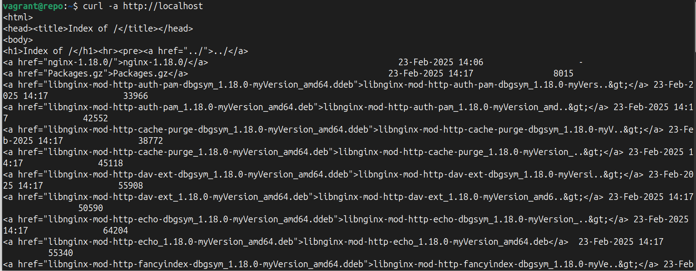
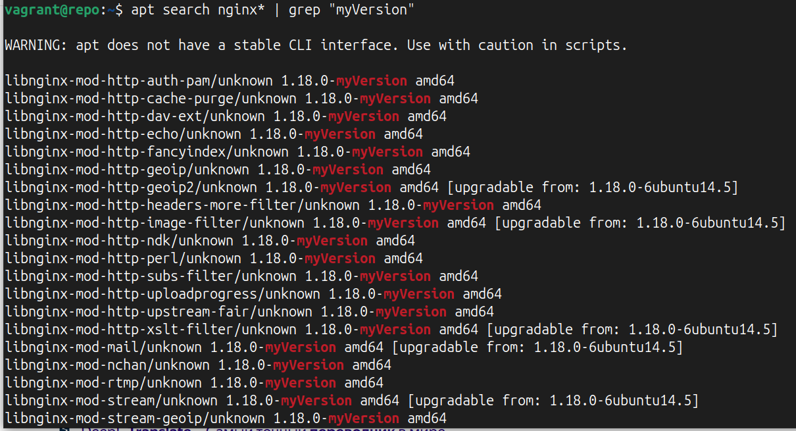

# Этапы создания репозитория в системе Ubuntu и сборка nginx с модулем brotli
## Среда для работы:
Host:

- Ubuntu 24.04
- ansible ver. 2.16.3
- vagrant 2.4.1
  
Guest:
- Ubuntu 22.04
## Необходимые дополнительные пакеты и библиотеки для сборки пакета их исходников
Весь список находится в yml файле  [ansible/roles/repo/vars/main.yml](ansible/roles/repo/vars/main.yml)
Закомментируемые пакеты уже входят в состав дистрибутива Ubuntu 22.04, для другой системы они могут понадобиться.
## Этапы сборки Nginx с модулем Brotli
1. Скачивание паке nginx с исходниками в созданную папку repo
2. Клонирование Brotli в папку с модулями nginx (repo/nginx-1.18.0/debian/modules) из ресурса [https://github.com/google/ngx_brotli](https://github.com/google/ngx_brotli)
3. В скаченной папке создается каталог out (ngx_brotli/deps/brotli/out)
4. В рабочем каталоге out выполняются следующие команды для сбборки модуля Brotli:
    - **cmake -DCMAKE_BUILD_TYPE=Release -DBUILD_SHARED_LIBS=OFF -DCMAKE_C_FLAGS="-Ofast -m64 -march=native -mtune=native -flto -funroll-loops -ffunction-sections -fdata-sections -Wl,--gc-sections" -DCMAKE_CXX_FLAGS="-Ofast -m64 -march=native -mtune=native -flto -funroll-loops -ffunction-sections -fdata-sections -Wl,--gc-sections" -DCMAKE_INSTALL_PREFIX=./installed ..**
   - **cmake --build . --config Release --target brotlienc**
5. В файл repo/nginx-1.18.0/debian/rules добавляется информация о новом модуле nginx
           **--add-module=$(MODULESDIR)\/ngx_brotli/' rules**
6. Из исходников собираются новые пакеты nginx, которые содержат новый модуль
           **dpkg-buildpackage -b ( в каталоге repo/nginx-1.18.0)**
7.  Настраивается nginx для отображения содержимого каталога с пакетами nginx
8.  Каталог repo переносится в папку /usr/local
9.  Данный каталог индексируется и в нем создается специализированный файл,содержащий индексы файлов репозитория
            **- dpkg-scanpackages /usr/local/repo /dev/null | gzip -9c > /usr/local/repo/Packages.gz**
10. Информация о новом репозитории добавляется в /etc/apt/source.list
## ИТОГИ
Через nginx видны файлы репозитория

Apt видит репозиторий

