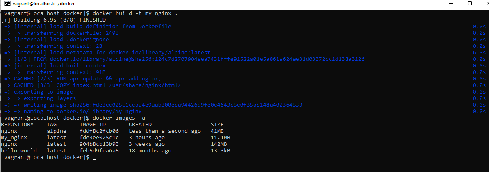

 #**Docker**
___________________________________________
## **Задание**
___________________________________________
1. Создать свой кастомный образ nginx на базе alpine. 
2. После запуска nginx должен отдавать кастомную страницу (достаточно изменить дефолтную страницу nginx).
3. Определить разницу между контейнером и образом.
4. Ответить на вопрос: Можно ли в контейнере собрать ядро?
5. Собранный образ необходимо запушить в docker hub и дать ссылку на репозиторий.
_____________________________________________________________________
## **Установка и настройка docker**
_____________________________________________________________________
1. Устанавливаем Пакет YUM-Utils - это набор утилит, реализующих дополнительные возможности для управления <\br> 
репозиториями, установки и отладки пакетов, поиска пакетов и т.д.<\br> 
             **sudo yum install -y yum-utils**
2. Добавляем репозиторий Docker 
3. Устанавливаем последнюю версию пакетов docker
4. Запускаем docker:
            **sudo systemctl start docker**
5. Проверяем работоспособность docker
            **sudo docker run hello-world**
 
            **sudo systemctl status docker**
             
6. Так как docker запускается под root или под пользователем, входящим в группу docker, то
добавим пользователя vagrant в эту группу:
          **sudo usermod -a -G docker vagrant**
  
7. Создаем html файл
8. Запускаем контейнер nginx на базе alpine с подключением volume
   **docker run -d -p 80:80 -v ~/html/://usr/share/nginx/html:rw nginx:alpine**
   
9. Обращаемся к nginx с кастомной страницей  
         **curl localhost:8080**  
 
______________________________
#### **Создание собственного образа контейнера**
Для создания образа контейнера необходимо создать [dockerfile](Dockerfile)         
 Создаем кастомный образ nginx my_nginx:  
 **docker build -t my_nginx**
Смотрим имеющиеся образы docker:  
**docker images**
  
Создадаем контейнер из созданного образа  
**docker run -it -p 8080:80 --name my_webserver my_nginx**  
Запустим контейнер  
**docker run -d -p 8080:80 --name my_webserver my_nginx**  
Проверяем работу контейнера:
**curl localhost:8080**
  
__________________________________________________
#### **Размещение созданного образа на докер хабе**
1. Залогонимся в докер  
**docker login**  
2. Пометим изображение: ,br>
**docker image tag my_nginx vaslin/my_nginx:1.0**
  
3. Запушим изображение в репозиторий докер  
**docker image push vaslin/my_nginx:1.0**
  
Мой образ: https://hub.docker.com/r/vaslin/my_nginx/tags
Скачать образ: docker pull vaslin/my_nginx:1.0
___________________________________________________
## Ответы на вопросы
_______________________
**1. Определить разницу между контейнером и образом**
Контейнером является среда в которой разворачивается образ, содержащий необходимые ресурсы для запуска приложения (процесса). 
Контейнер является полноценной средой с развернутым образом, в которой образ может подвергаться изменениям.
Образ же является готовым продуктом и по своей сути является неизменяемым шаблоном среды.  
**2. Можно ли в контейнере собрать ядро?**
Контейнер использует ядро домашней системы и поэтому внутри него собрать ядро не возможно.
