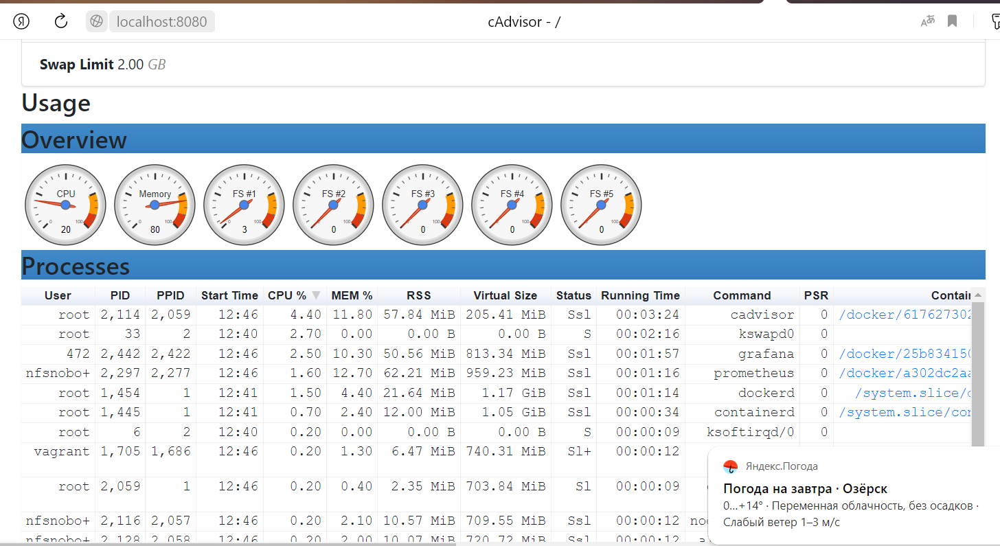
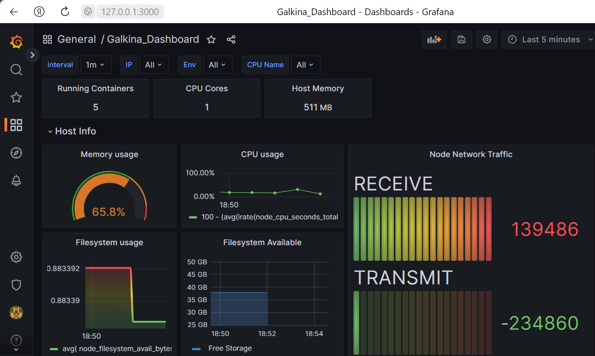

1. Скорируем гитхаб с настроенным Prometheus, node-exporter, grafana... 
 git clone https://github.com/vegasbrianc/prometheus.git  
  
2. запускаем docker 
 *sudo systemctl start docker* 
3. запускаем docker compose 
 *docker compose up* 
  
 4. Проверяем работу контейнеров:
 Prometheus -   
 Node-exporter-   
 cAdviser-    
5. Собственный Dashboard  
 

