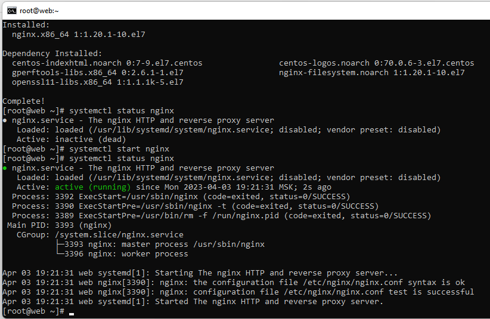

# Описание домашнего задания
1. В Vagrant разворачиваются 2 виртуальные машины web и log.  
2. На web настраиваем nginx. 
3. Наlog настраиваем центральный лог сервер на любой системе на выбор: 
- journald; 
- rsyslog; 
- elk. 
4. Настраиваем аудит, следящий за изменением конфигов nginx. 
Все критичные логи с web должны собираться и локально и удаленно. 
Все логи с nginx должны уходить на удаленный сервер (локально только критичные). 
Логи аудита должны также уходить на удаленную систему. 
_______________________________________________________________________________
# Выполнение задания
### Настройка времени
Для правильной работы c логами, нужно, чтобы на всех хостах было настроено одинаковое время. 
Укажем часовой пояс (Московское время): 
**cp/usr/share/zoneinfo/Europe/Moscow /etc/localtime** 
Перезупустим службу NTP Chrony:  
**systemctl restart chronyd** 
Проверим, что служба работает корректно:  
**systemctl status chronyd** 
 
### Установка nginx на виртуальной машине web
Для установки nginx сначала нужно установить epel-release:  
**yum install epel-release** 
Установим nginx:  
**yum install -y nginx** 
 
### Настройка центрального сервера сбора логов ntp 
rsyslog должен быть установлен по умолчанию в нашёй ОС, проверим это: 
**yum list rsyslog** 
 
Все настройки Rsyslog хранятся в файле /etc/rsyslog.conf 
Для того, чтобы наш сервер мог принимать логи, нам необходимо внести следующие изменения в файл: 
### Открываем порт 514 (TCP и UDP): 
В конец файла /etc/rsyslog.conf добавляем правила приёма сообщений от хостов: 
**$template RemoteLogs,"/var/log/rsyslog/%HOSTNAME%/%PROGRAMNAME%.log" 
*.* ?RemoteLogs 
& ~** 
Далее сохраняем файл и перезапускаем службу rsyslog: 
 **systemctl restart rsyslog** 
Проверяем настройки: будут видны открытые порты TCP,UDP 514: 
 ss -tuln 
  
 ### Настроим отправку логов с web-сервера 
 Версия nginx должна быть 1.7 или выше.  
 **rpm -qa | grep nginx** 
  У нас nginx-1.20.1-10.el7.x86_64 
 Находим в файле /etc/nginx/nginx.conf раздел с логами и приводим их к следующему виду: 
*error_log /var/log/nginx/error.log;* 
*error_log syslog:server=192.168.56.15:514,tag=nginx_error;* 
*access_log syslog:server=192.168.56.15:514,tag=nginx_access,severity=info combined;* 
 
Для Access-логов указываем удаленный сервер и уровень логов, которые нужно отправлять. Для 
error_log добавляем удаленный сервер. Если требуется чтобы логи хранились локально и отправлялись 
на удаленный сервер, требуется указать 2 строки. 
Tag нужен для того, чтобы логи записывались в разные файлы. 
По умолчанию, error-логи отправляют логи, которые имеют severity: error, crit, alert и emerg. 
Далее проверяем, что конфигурация nginx указана правильно:  
**nginx -t** 
 
Чтобы проверить, что логи ошибок также улетают на удаленный сервер, можно удалить картинку, к 
которой будет обращаться nginx во время открытия веб-сраницы: 
**rm /usr/share/nginx/html/img/header-background.png** 
Попробуем несколько раз зайти по адресу http://192.168.56.10 
 
Видим, что логи отправляются корректно. 
### Настройка аудита, контролирующего изменения конфигурации nginx 
-Проверим  пред установку утилиты auditd: 
 **rpm -qa | grep audit** 
 --audit-2.8.5-4.el7.x86_64 
--audit-libs-2.8.5-4.el7.x86_64 
### Настроим аудит изменения конфигурации nginx: 
Добавим правило, которое будет отслеживать изменения в конфигруации nginx. Для этого в конец 
файла /etc/audit/rules.d/audit.rules добавим следующие строки: 
*-w /etc/nginx/nginx.conf -p wa -k nginx_conf* 
*-w /etc/nginx/default.d/ -p wa -k nginx_conf* 
Данные правила позволяют контролировать запись (w) и измения атрибутов (a) в: 
● /etc/nginx/nginx.conf 
● Всех файлов каталога /etc/nginx/default.d/ 
Для более удобного поиска к событиям добавляется метка nginx_conf 
Перезапускаем службу auditd: 
 **service auditd restart** 
 После данных изменений у нас начнут локально записываться логи аудита. Чтобы проверить, что 
логи аудита начали записываться локально, нужно внести изменения в файл /etc/nginx/nginx.conf 
или поменять его атрибут, потом посмотреть информацию об изменениях: 
**ausearch -f /etc/nginx/nginx.conf** 

Также можно воспользоваться поиском по файлу /var/log/audit/audit.log, указав наш тэг: 
**grep nginx_conf /var/log/audit/audit.log** 

### Далее настроим пересылку логов на удаленный сервер. 
Auditd по умолчанию не умеет пересылать логи, для пересылки на web-сервере потребуется установить пакет audispd-plugins: 
 **yum -y install audispd-plugins** 
Найдем и поменяем следующие строки в файле /etc/audit/auditd.conf: 
 
В файле /etc/audisp/plugins.d/au-remote.conf поменяем параметр active на yes: 
 
В файле /etc/audisp/audisp-remote.conf требуется указать адрес сервера и порт, на который будут 
отправляться логи: 
 
Далее перезапускаем службу auditd:  
**service auditd restart** 
### Настроим Log-сервер. 
Откроем порт TCP 60, для этого уберем значки комментария в файле /etc/audit/auditd.conf: 
 
Перезапускаем службу auditd: 
**service auditd restart** 
## Результат 
На этом настройка пересылки логов аудита закончена. Можем попробовать поменять атрибут у файла 
/etc/nginx/nginx.conf и проверить на log-сервере, что пришла информация об изменении атрибута: 
**ls -l /etc/nginx/nginx.conf** 
**chmod +x /etc/nginx/nginx.conf** 
  
проверить на log-сервере, что пришла информация об изменении атрибута 
**grep web /var/log/audit/audit.log** 
  
## Итог
Весь процесс настроек логов автоматизирован с помощью ансибл. 
