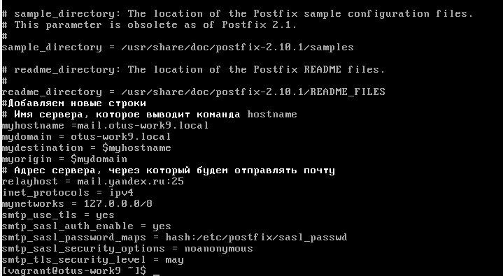
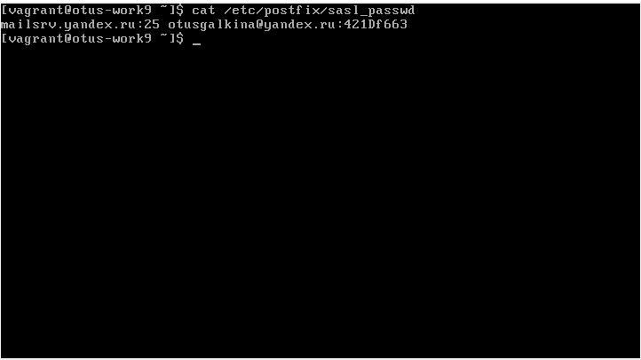
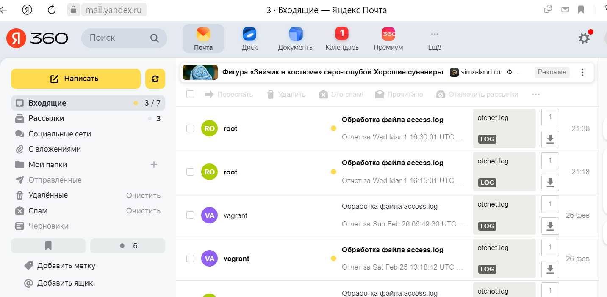

 **Bash**
___________________________________________
## **Задание**
___________________________________________
           Написать скрипт для CRON, который раз в час будет формировать письмо и отправлять на заданную почту.
Необходимая информация в письме:
1. Список IP адресов (с наибольшим кол-вом запросов) с указанием кол-ва запросов c момента последнего запуска скрипта;
2. Список запрашиваемых URL (с наибольшим кол-вом запросов) с указанием кол-ва запросов c момента последнего запуска скрипта;
3. Ошибки веб-сервера/приложения c момента последнего запуска;
4. Список всех кодов HTTP ответа с указанием их кол-ва с момента последнего запуска скрипта.
5. Скрипт должен предотвращать одновременный запуск нескольких копий, до его завершения.
_____________________________________________________________________
## **Скрипт для СRON**
_____________________________________________________________________
1. Скрипт можно просмотреть [тут](./scriptotchet.sh).
2. Описание действий представлено в виде комментарий в скрипте.
3. Скрипт обрабатывает временной промежуток представленного файла access.log ([посмотреть тут](./access.log))
с 14 августа 2019 г время 23:50:26  
по 15 августа 2019 г время 00:01:54  
В скрипте предусмотрен временной промежуток с последнего создания отчета по настоящее время для оригинального файла access.log.
______________________________________________
## **Отправка почтой**
______________________________________________
1. Для отправки почтой отчета, созданного скриптом, понадобился пакет **mailx** 
*yum install mailx* 
2. Настройка почты была произведена с помощью пакета postfix. 
**Настройка postfix на отправку локальных писем через внешний сервер с авторизацией по smtp** 
1) Добавляем новые строки в файл настроек *cat /etc/postfix/main.cf* 
 
2) Создаем файл с информацией об имени пользователя и пароле для авторизации. */etc/postfix/sasl_passwd* 
 
Указывается почта и пароль для ее авторизации, на которую будет отсылаться файл отчета. 
3)Создаем  файл postfix db. 
*sudo postmap /etc/postfix/sasl_passwd* 
4)Перезапускаем postfix 
*sudo postfix reload* 
5)Почта отправляет файл отчета на адрес otusgalkina@yandex.ru командой из скрипта 
*echo "Отчет за $(date)" | mailx -s "Обработка файла access.log" -a /vagrant/otchet.log otusgalkina@yandex.ru* 
______________________________________________
## **Задание CRON**
______________________________________________
1. Установим пакет **cronie** 
*yum install cronie* 
2. Задание для cron создано командой: 
*crontab -l | { cat; echo "*/1 * * * * /usr/bin/flock -xn /var/lock/scriptotchet.lock -c 'sh /home/vagrant/scriptotchet.sh'"; } | crontab -* 
3. Просмотреть задания для cron можно командой **crontab -l** 
____________________________________________
## **Итог**
Файл отчета отправлен на почту яндекс. 

