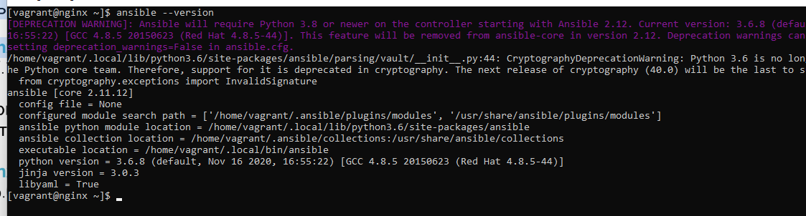
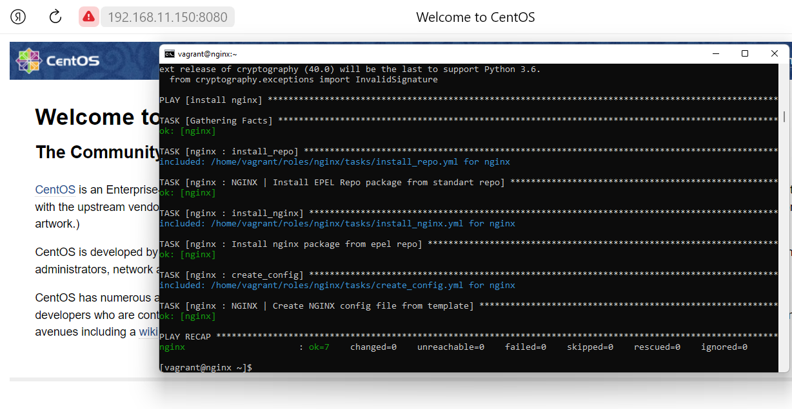

# **Задание:**
Используя Ansible необходимо развернуть nginx со следующими условиями:
1. необходимо использовать модуль yum/apt;
2.  конфигурационные файлы должны быть взяты из шаблона jinja2 с перемененными;
3.  после установки nginx должен быть в режиме enabled в systemd;
4.  должен быть использован notify для старта nginx после установки;
5.  сайт должен слушать на нестандартном порту - 8080, для этого использовать переменные в Ansible.
_______________________________________________
# **Работа с Ansible**
_________________________________________________
## **Подготовка стенда**
_____________________________
 ### **Установка Ansible**
 #### **Установка python3**
1. **sudo yum install python3
2. Проверить установку можно командой проверки версии пакета: python -V

 #### **Установка пакета pip python3** 
1. Подключение репозитория и скачивание модуля pip для версии 3.6  
**sudo curl -LO https://bootstrap.pypa.io/pip/3.6/get-pip.py  
2. Установка pip  
**sudo python3 get-pip.py --user**  
 #### **Установка ansible через пакет pip**
**python3 -m pip install --user ansible** 

### **Настройка хоста nginx**
1. Создаем rsa ключи
**ssh-keygen -t rsa** 
2. На удалённом сервере (nginx)— включаем авторизацию по ключам. 
В файле /etc/ssh/sshd_config убираем комментарии перед строками: 
*RSAAuthentication yes  
*PubkeyAuthentication yes  
*AuthorizedKeysFile .ssh/authorized_keys.  
3. Перезапускаем SSH-сервер
**sudo service sshd restart**
4. Проверяем доступ к серверу nginx
**ansible nginx -i hosts -m ping**
_______________________________________________
## **Описание Playbook**
1. В папке vagrant находится vagrantfile, который скачивает готовую машину с 
установленным и настроенным Ansible.
2. Роль ansible (домашнее задание) находится в папке ans_roles:
- Плейбук: nginx.yml
вызывает роль nginx
- Tasks: Установка репозитория epel, Установка nginx,
 Настройка конфига nginx
-Vars: настройка порта nginx

