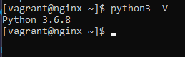
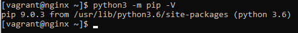

# **Работа с Ansible**
_________________________________________________
## **Подготовка стенда**
_____________________________
 ### **Установка Ansible**
 #### **Установка python3**
1. **sudo yum install python3
2. Проверить установку можно командой проверки версии пакета: python -V

#### **Установка пакета pip python3** 
1. Подключение репозитория и скачивание модуля pip для версии 3.6  
**sudo curl -LO https://bootstrap.pypa.io/pip/3.6/get-pip.py  
2. Установка pip  
**sudo python3 get-pip.py --user  

