# **Работа с загрузчиком GRUB**
___________________________________________
## **Зайти в систему через загрузчик**
___________________________________________
1. Для того, чтобы попасть в загрузчик системы при ее загрузке, необходимо нажать "e"(edit) при появлении окна выбора ядра системы.
2. **Способ 1.** В конце строки начинающейся с *linux16* добавляем  init=/bin/sh  и нажимаем **сtrl-x** для
загрузки системы:
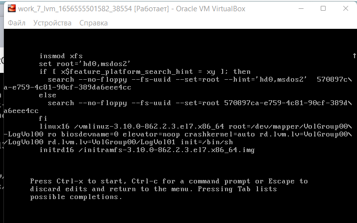

- Рутовая файловая система при этом монтируется в режиме *Read-Only*. Поэтому её необходимо   перемонтировать режим *Read-Write*:
**mount -o remount,rw /**

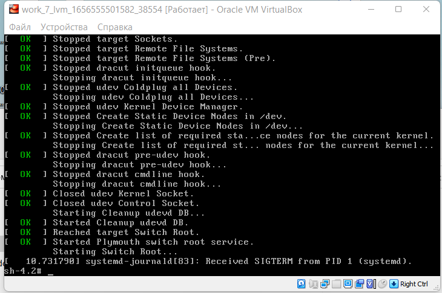

- Проверим, что перешли в режим *rw*. Для этого создадим файл "file1" в папке /home и поместим в него текст "privet": 

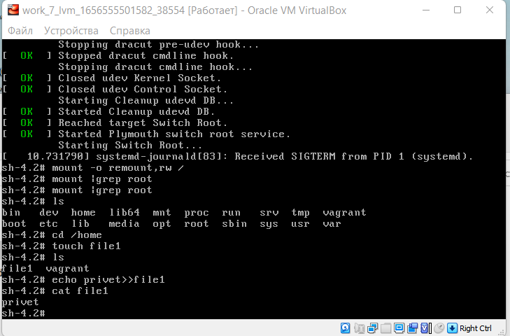
 
3. **Способ 2.** В конце строки начинающейся с *linux16* добавляем  rd.break  и нажимаем **сtrl-x** для
загрузки системы:
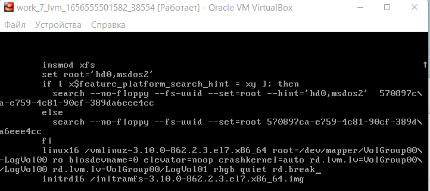

- Рутовая файловая система при этом монтируется в режиме *Read-Only*.

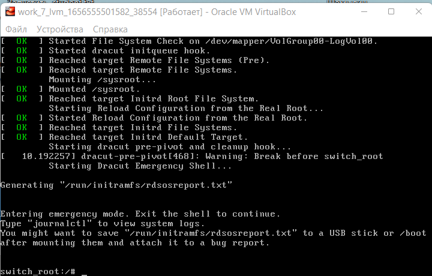
- Теперь нужно попасть в систему в режиме *rw* и назначить новый пароль root:
- [x]	mount -o remount,rw /sysroot
- [x] chroot /sysroot
- [x] passwd root
-	Проверим, что теперь система в режиме *RW* : **touch /.autorelabel**
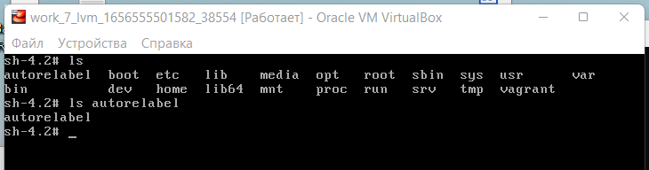

4. **Способ 3.** В строку начинающейся с *linux16* добавляем  rw init=/sysroot/bin/bash  и нажимаем **сtrl-x** для
загрузки системы:
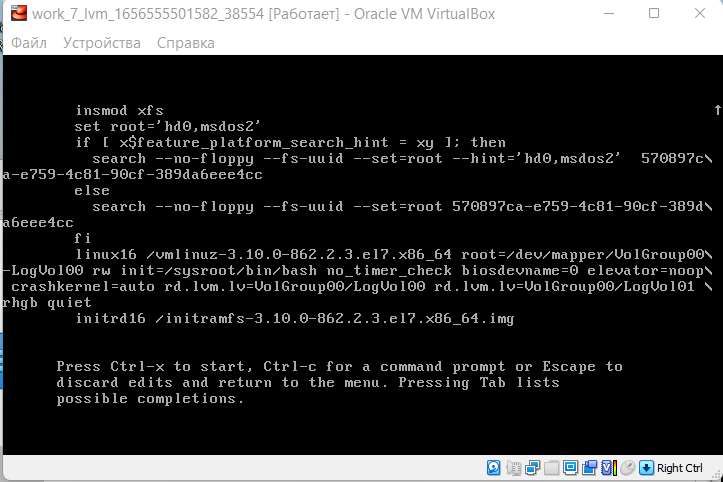
- Система загружается сразу в режиме *RW*:
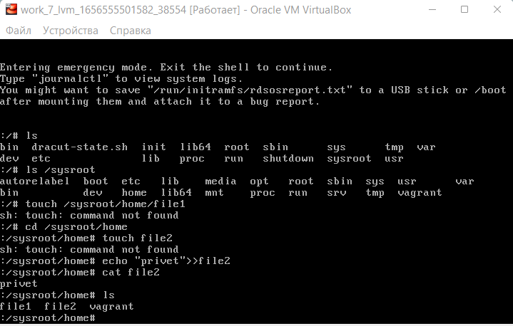
_____________________________________________________________________
## **Установить систему с LVM, после чего переименовать VG**
_____________________________________________________________________
1. Убедимся в наличии *lvm*: **vgs**
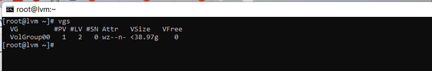
2. Переименуем *Volume* группу: **vgrename VolGroup00 OtusRoot**

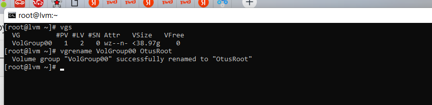
3. Правим файл монтирования: **vi /etc/fstab**

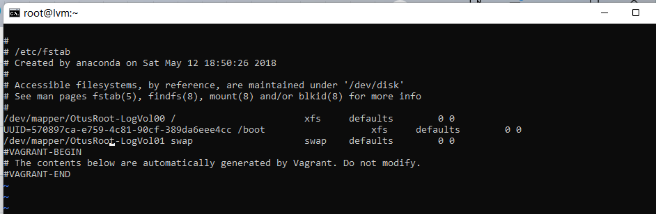
4. Правим файл с начальными настройками загрузчика: **vi /etc/default/grub**

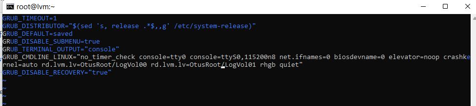
5. Правим конфигурационный файл загрузчика: **vi /boot/grub2/grub.cfg**

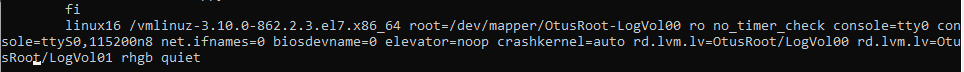
6. Пересобираем образ файловой системы, загружаемый в оперативную память вместе с ядром - **initramfs**: 
**mkinitrd -f -v /boot/initramfs-$(uname -r).img $(uname -r)**

7. Перезагружаем систему и убеждаемся, что LVM имеет измененное имя Volume Group:

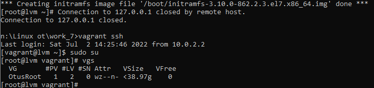 
______________________________________________
## **Добавить модуль в initrd**
______________________________________________
1. Создадим папку с именем *01test*:**mkdir /usr/lib/dracut/modules.d/01test**

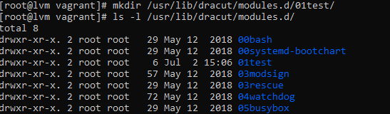

2. В созданную папку помещаем скрипт *module-setup.sh*:

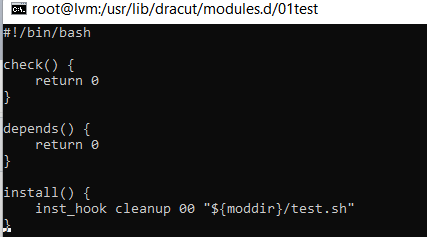

3.  В созданную папку помещаем скрипт *test.sh*:

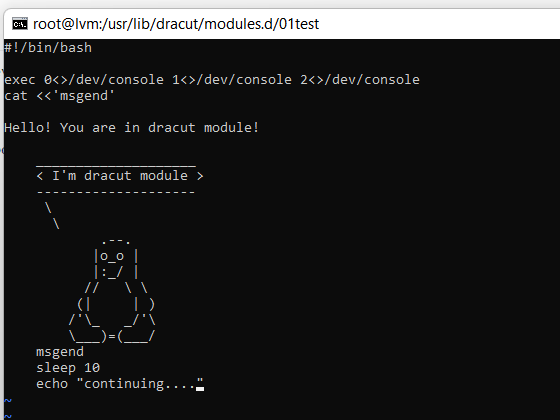

4.  Пересобираем образ файловой системы, загружаемый в оперативную память вместе с ядром - **initramfs**: 
**mkinitrd -f -v /boot/initramfs-$(uname -r).img $(uname -r)** 
или 
**dracut -f -v**

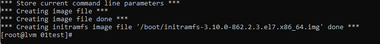

5. Убедимся, что модуль test загружен в образ: **lsinitrd -m /boot/initramfs-$(uname -r).img | grep test**

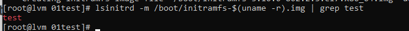

6. Отредактируем файл grub.cfg. Убираем параметры rghb и quiet.
**В результате загрузки системы подзагружается новый модуль**

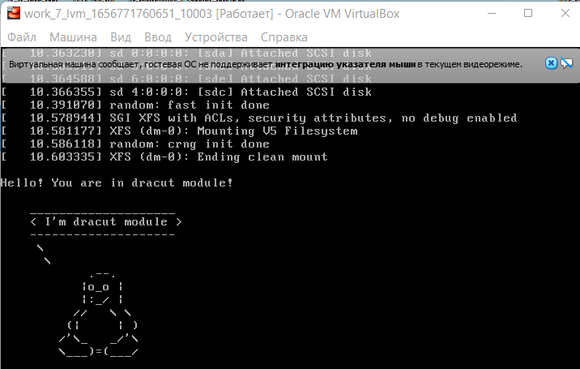

____________________________________________
## **Вывод**
_____________________________________________
Файл Vagrant подзагружает box из облака, в котором уже есть LVM и переименована Volume Group,  
а также при запуске системы в графическом режиме Virtual Box можно увидеть встроенный модуль ядра при загрузке системы.

