# **Systemd**
___________________________________________
## **Создание сервиса мониторинга**
___________________________________________
1. Создадим файл конфигурации для сервиса: /etc/sysconfig/watchlog.cfg
**echo "Congiguration file for my watchdog service">watchlog.cfg**  
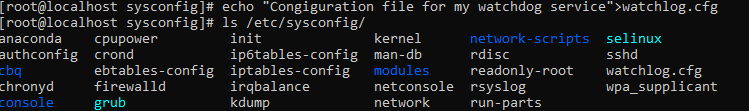
 В файл конфигурации добавляем слово Alert, которое сервис мониторинга будет искать в лог файле */var/log/watchlog.log* 

2. Создадим лог файл со словами: /var/log/watchlog.log:
            **touch /var/log/watchlog.log** 
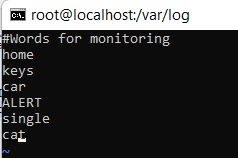 
3. Создаем скрипт, который ищет заданное слово в лог файле: */opt/watshlog.sh* 
Даем права на выполнение скрипта chmod +x /opt/watshlog.sh 
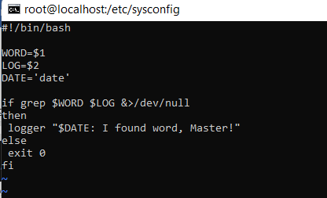 
4. Создаем сервис мониторинга и таймер для его периодическго запуска в директории /etc/systemd/ 
см. файлы watchlog.service и watchlog.timer. 
5. Запускаем созданные сервис и таймер systemd.  
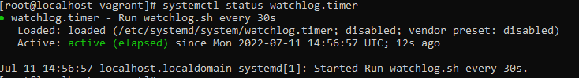 
6. Проверим работу системы мониторинга: 
**tail -f /var/log/messages** 
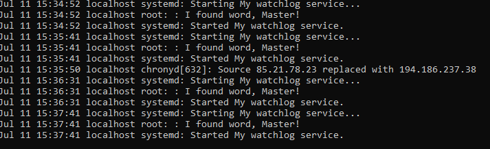 
_____________________________________________________________________
## **Переписать init-скрипт на unit-файл**
_____________________________________________________________________
1. Устанавливаем spawn-fcgi и необходимые для него пакеты: 
**yum install epel-release -y && yum install spawn-fcgi php php-cli mod_fcgid httpd -y**
2. В файле /etc/sysconfig/spawn-fcgi раскомментируем строку "OPTIONS". 
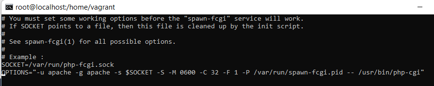 
3. Создаем юнит: **vi /etc/systemd/system/spawn-fcgi.service** .
см. файл spawn-fcgi.service.  
4. Запускаем созданный сервис.  
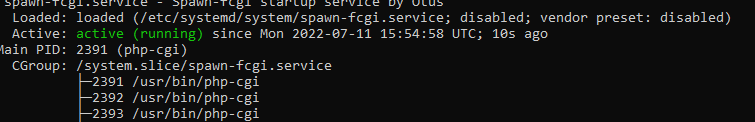 
______________________________________________
## **Одновременный запуск сервиса httpd с разными конфигами**
______________________________________________
1. Найдем местоположение файла httpd.service. 
 

2. Скопируем httpd.service как шаблон в каталог /etc/systemd/system: 
**cp /usr/lib/systemd/system/httpd.service /etc/systemd/system/httpd@.service** 
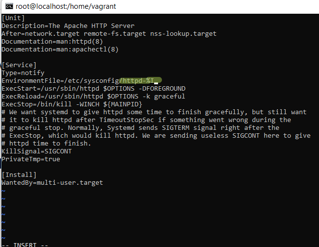

3.  Добавим имя экземпляра  в шаблоне %I: 
 **vi /etc/systemd/system/httpd\@.service** 
 

4.  Создаем два файла окружения в директории, копируя файл /etc/sysconfig/httpd:httpd-first и httpd-second: 
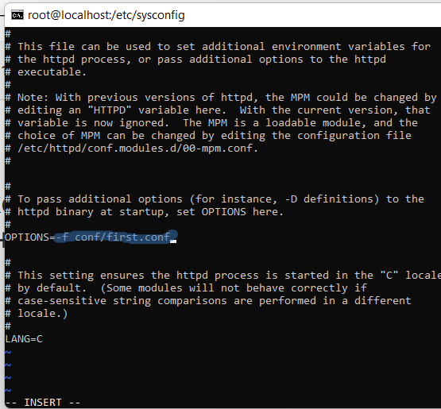

5. В файлазх окружения задаетсā опция для запуска веб-сервера с необходимым конфигурационным файлом.  
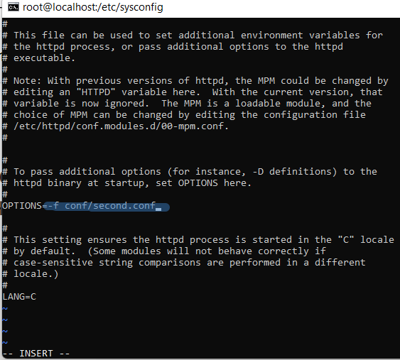 

6. Переходим в директорию с конфигами httpd: /etc/httpd/cong/. 
Копируем оригинальный конфиг httpd.conf под именами  first.conf и second.conf.  
Внесем изменения только в second.conf.  
Добавим строчку PidFile /var/run/httpd-second.pid и Изменим порт для прослушивания на 8080 : Listen 8080.  
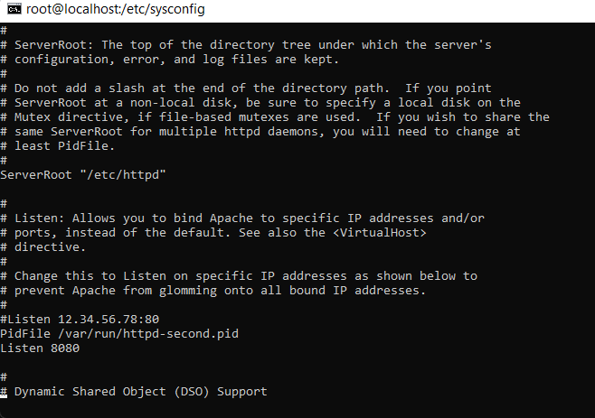 
7. Запустим сервис httpd с разными конфигурационными файлами: 
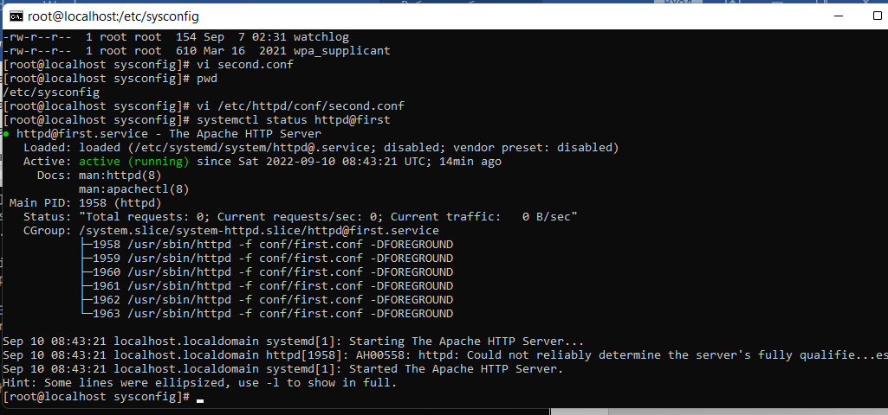 
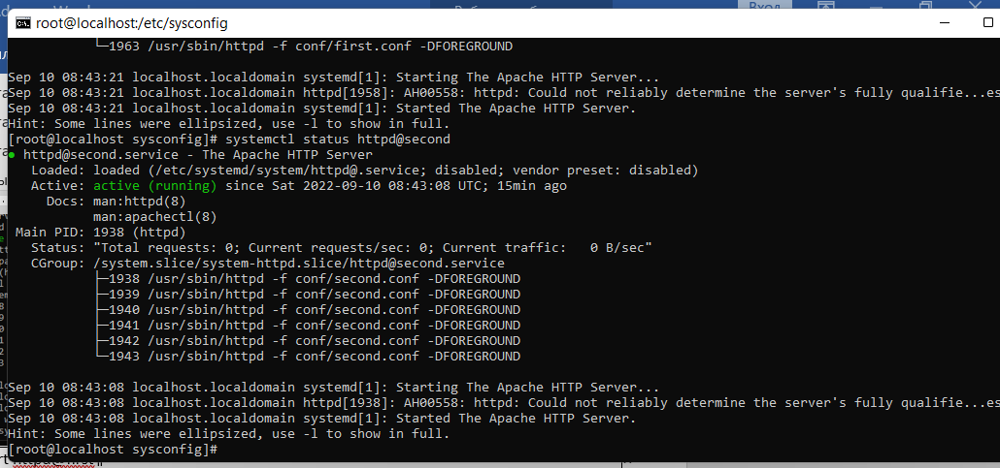 
____________________________________________
## **Вывод**
В данной работе рассмотрели создание юнитов systemd, их запуска. Рассмотрели способ одновременного запуска сервиса с разными конфигурационными файлами.
_____________________________________________
Файл Vagrant подзагружает box из облака, в котором уже есть сервис мониторинга. его только нужно запустить.
Настроен httpd сервис для запуска с разными конфигурациями.

