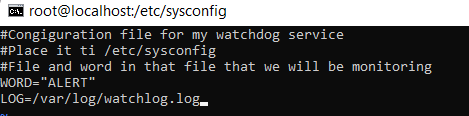

# **Systemd**
___________________________________________
## **Создание сервиса мониторинга**
___________________________________________
1. Создадим файл конфигурации для сервиса: /etc/sysconfig/watchlog.cfg
**echo "Congiguration file for my watchdog service">watchlog.cfg**  

 В файл конфигурации добавляем слово Alert, которое сервис мониторинга будет искать в лог файле */var/log/watchlog.log* 

2. Создадим лог файл со словами: /var/log/watchlog.log:
            **touch /var/log/watchlog.log** 
 
3. Создаем скрипт, который ищет заданное слово в лог файле: */opt/watshlog.sh* 
Даем права на выполнение скрипта chmod +x /opt/watshlog.sh 
 
4. Создаем сервис мониторинга и таймер для его периодическго запуска в директории /etc/systemd/ 
см. файлы watchlog.service и watchlog.timer. 
5. Запускаем созданные сервис и таймер systemd.  
 
6. Проверим работу системы мониторинга: 
**tail -f /var/log/messages** 
 
_____________________________________________________________________
## **Переписать init-скрипт на unit-файл**
_____________________________________________________________________
1. Устанавливаем spawn-fcgi и необходимые для него пакеты: 
**yum install epel-release -y && yum install spawn-fcgi php php-cli mod_fcgid httpd -y**
2. В файле /etc/sysconfig/spawn-fcgi раскомментируем строку "OPTIONS". 
 
3. Создаем юнит: **vi /etc/systemd/system/spawn-fcgi.service** .
см. файл spawn-fcgi.service.  
4. Запускаем созданный сервис.  
 
______________________________________________
## **Добавить модуль в initrd**
______________________________________________
1. Создадим папку с именем *01test*:**mkdir /usr/lib/dracut/modules.d/01test**

2. В созданную папку помещаем скрипт *module-setup.sh*:

3.  В созданную папку помещаем скрипт *test.sh*:

4.  Пересобираем образ файловой системы, загружаемый в оперативную память вместе с ядром - **initramfs**: 
**mkinitrd -f -v /boot/initramfs-$(uname -r).img $(uname -r)** 
или 
**dracut -f -v**

5. Убедимся, что модуль test загружен в образ: **lsinitrd -m /boot/initramfs-$(uname -r).img | grep test**

6. Отредактируем файл grub.cfg. Убираем параметры rghb и quiet.
**В результате загрузки системы подзагружается новый модуль**

____________________________________________
## **Вывод**
_____________________________________________
Файл Vagrant подзагружает box из облака, в котором уже есть LVM и переименована Volume Group,  
а также при запуске системы в графическом режиме Virtual Box можно увидеть встроенный модуль ядра при загрузке системы.

